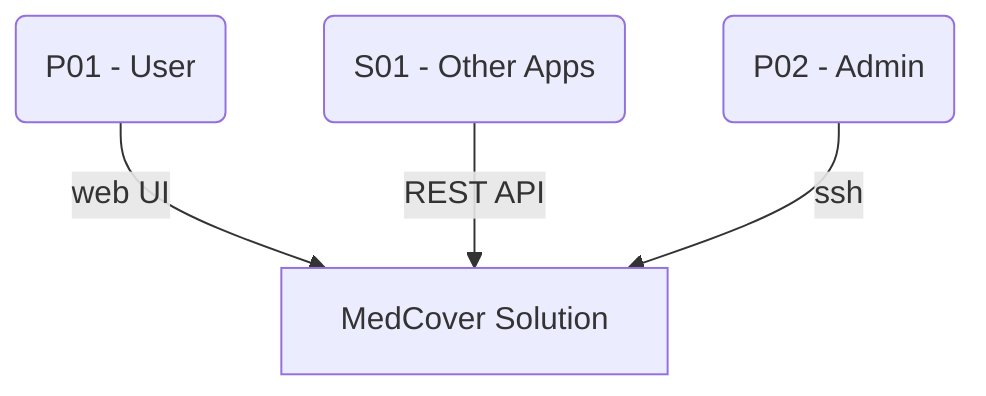

# MedCover Planner app

## Business Context and Goals

### Overall Idea
- a web application for planning medical cover for Events
- developed by and to be primarily used by the Czech Red Cross organization
- the app shall replace the current Google Sheets app that is used for the same purpose and is reaching its limits
- the app shall meet all the current requirements and allow seamless transition

### Assumptions and Constraints
xxx

## Functional Requirements
Users administration:  
    - app roles (authorization) - admin, coordinator, member, viewer  
    - qualification - Doctor, Nurse (SZP), First Aider (zdravotník), Trainee (zelenáč)  
        - qualifications should allow hierarchy so that for example Nurse will be able to take a spot that requires a trainee automatically.
        - admin will have permissions to create, edit, delete the qualification (including the hierarchy)
        - including training/certifications - driver, humanitarian unit training, PSP training, etc.  
    - member equipment - uniform assigned, etc.  
    - phone number, email  
    - reporting/overview section - overview of hours worked, planned, nearest registered Event, last registered Event, etc.  
    - new User Registration shall require an admin approval. (perhaps the User Registrations may be only available via admin-generated User Registration link, for added security)
- Master Event (ME):
    - an Event (dozor) is typically an individual happening, but there may cases where the cultural/sports Event is too large, is happening over several days and on multiple places in parallel. In such cases it is needed to categorize the Events (dozory) under an overarching entity. Let's call it a Master Event. By default, a newly created Event will fall under the "general" category (běžný dozor). But the admins/coordinators will be able to create new MEs (corresponding to the large music festivals, sports Events etc.). This should allow the coordinators to better organize the large Events.
    - The ME view should provide an overview of all the Events (dozory) that belong to this ME, Assignment status, worked hours, number of finished Events, canceled Events, open Events, etc. For the General ME this shall provide the yearly overview of the medical cover operations.
- Event
    - Each Event shall have
        - lifecycle statuses
            - Draft
            - Published
            - Assignments Open
            - Assignments Closed
            - Completed
            - Cancelled
        - staffing statuses
            - Not staffed
            - Partially staffed
            - Fully staffed
            - Overstaffed
    - Event management - Create, modify, cancel Events
    - Event templates
        - some Events are very similar, so it would make sense to have a system of templates which will simplify creation of a new Event. for example specifying that a simple Event needs 1 First Aider and 1 Trainee; bigger Event will require 2 First Aiders, 2 Trainees and an ambulance.
        - the template will only pre-fill the Event creation dialog but it will still allow to customize the Event to full extent
        - admins shall be able to create, edit, delete templates
    - parametrize Events
        - start date,
        - start time,
        - end date,
        - end time,
        - number of Patrols (hlídky zdravotníků) - 1 as a default, but can be more. Patrols are only an abstract number which helps to determine the number of people needed for the Event and the organization on site. However, the on-site organization is not important for this application. Shall the happening be more complex, requiring more granular medical aid organization, it's expected that multiple Events (or even a ME) would be created for it.
        - required personnel (how many of each qualification or training kind are needed. multiple qualifications for one spot can be specified - for example 1 First Aider who is also a Driver, 2 Trainees). typically one Patrol is one First Aider and one Trainee.
        - when a person is assigned to an Event and is eligible for multiple roles, it must be specified which of the roles will this person cover. for example in an event where 1 Doctor, 1 Driver/First Aider and 1 First Aider are needed a Doctor/Driver getting assigned must select which spot he is taking.
        - required equipment (ambulance, tent, PR material, etc.),
        - optional parameter for setting maximum personnel of each qualification or training
        - paid or unpaid Event
        - date/time of Assignments opening ("immediately" being the default) - some Events can be active but not open for Assignment
        - contact person, Event address
    - The Responsible Person mechanism:
        - Each Event shall have a Responsible Person (RP) assigned before the Event start date/time.
        - Typically the first First Aider who registers to an Event becomes the RP.
        - The RP can be assigned or changed by the coordinator/admin
        - Once the RP is assigned, he/she is responsible for managing the other personnel on that Event.
        - On Events that belong to a custom ME (for example large music festivals), the ME coordinator may force becoming the RP for all the Events in this ME, allowing the coordinator to have overall control of the ME
        - The RP shall be notified about changes in the Event, for example users switching spots, or coordinator/admin changing some parameters of the Event
    - If someone removes his/her's Assignment from an Event, all users who fulfill the spot requirements will be notified about the new Assignment possibility/need
    - If the Event is nearing its start and it's still not fully occupied, all users who fulfill the spot requirements will get an email notification about the urgent need for filling the spot
    - The users registered to an Event shall have an option to transfer the Assignment to a different user (typical scenario is that the user will get sick and will agree with ta colleague to step in)
- Equipment
    - create, modify, delete equipment types (such as AED, medikit etc.),
    - manage equipment inventory
        - item name, item type,
        - item location - this is the default location where the equipment belongs to and where it should be returned after an Event. 
        - item dislocation - this may be an Event or a person who borrowed the equipment temporarily  
- The app must be accessible via Internet
- The app must have authentication
- Display the Events in a form of a table or calendar
- Email notifications and reminders
    - individual users can set their own reminders for Events they have subscribed in
    - admins, coordinators and RPs can send emails to remind selected roles that they are needed for Events that are not fully occupied
    - Admins should be notified about each change in the system - it might be a digest once a day or more frequently, if there are a lot of changes in a short period of time.
- Notifications should be customizable to prEvent unnecessary spamming (possible customization on the level of the ME, Event,...)
- Audit capability (view changes for individual entities, app configuration etc.)

## Non-Functional Requirements
- The app must be user friendly and very easy to use - not all users are very skilled at IT
- There should be tooltips helping users use the app
- The app must be available 24/7
- The app UI must be in Czech language
- The app UI must be optimized for both PC and mobile phone screens - most users will access the app using their mobile phones
- all changes must be logged and allow auditing - who changed what and when
- The infrastructure used by the app should allow backup/restore of the app. Daily backups with 60 days retention, 1day RPO, 12 hours RTO

## Architectural Decisions
- AD01 User Roles Customization
    - Problem statement - Should the user roles be hardcoded or customizable?
    - Decision - Hardcoded pre-defined roles, adding custom roles may be added to the app later
    - Justification - app roles are sets of permissions (see AD02) 
      they are relatively stable and allow good testing. Custom roles may be added to the app later but at this point, for simplicity, only pre-defined roles will be used.

- AD02 Application Object Permissions
    - Problem statement - It is not known exactly how the user roles will look like in the final app. The app should allow granular permission assignment to roles to provide flexibility.
    - Options
        - Minimalistic approach - define only create/edit/view permissions per app module
        - Maximum flexibility - design the app in a way that each meaningful component/object/action will have a permission associated with it
    - Decision - Maximum flexibility
    - Justification
        - All objects in the application (such as Equipment, Event, Master Event, User) shall have permission objects assigned to it. This will allow granular permissions assignment to user roles. However, there will be only pre-defined RBAC roles (admin, coordinator, member, viewer) at this time. Custom roles may be implemented in the future, so the object based permission model should be prepared for this.
        - Admins and Coordinators should be able to edit all Events and change people assignment to Events. This should be useful if a person can't change their own reservation, an admin or coordinator can do it for them.
        - Example permissions:  
            user.view  
            user.edit  
            Event.create  
            Event.edit  
            Event.cancel  
            Event.publish  
            Event.assign  
            Event.set_responsible_person  
            equipment_type.view  
            equipment_type.edit  
            equipment_type.create  
            audit.view  
            notification.send  
            master_Event.view  
            master_Event.edit  
            master_Event.create  
            master_Event.cancel  
            master_Event.assign

## Architecture Overview

## System Context
The System Context is typically a combination of a System Context Diagram and a textual description of its components. It describes how the solution (in this case the application) fits to a larger context of other applications, services and persons (users) around it.  
(TODO - add trust boundaries and high-level data exchanged with the external apps)

| Entity ID | Entity Type | Entity Name | Description |
|-----------|-------------|-------------|-------------|
| P01       | Person      | User        | Users accessing the app via a Web UI over public Internet |
| S01       | System | Other Apps  | **Optional** - for later, allowing other apps to interact with the app over REST API |
| P02       | Person | Admin  | App/infrastructure administrator |

## Component Model
- Major application components or services
- Their responsibilities
- Interfaces and dependencies
- Collaboration between components
- Logical vs physical realization if needed

## Runtime / Interaction View
- Key end-to-end scenarios
- Sequence diagrams / flows for major use cases
- Error and exception paths
- Async processing, retries, idempotency, transactions, eventual consistency

## Data View
- Core domain/data model (high level)
- Data ownership and boundaries
- CRUD responsibilities
- Data stores
- Data flow / lineage
- Retention, privacy, classification, encryption

## Integration Model
- APIs / events / messaging
- Protocols and formats
- Integration patterns
- Dependency on external platforms/services
- Failure handling and SLAs

## Deployment Model
- Environments
- Deployment topology
- Runtime platforms
- Network zones / connectivity
- HA/DR topology
- Monitoring, logging, alerting
- Backup / restore / patching / support model

### Role Based Access Control (RBAC)
The application will be built using the RBAC concept where User Accounts will be assigned to one or more Roles.  
A Role will be assigned to Permissions. (A Role is a set of permissions)  
For example an User Account assigned to the Admin role will have all the permissions of this role, allowing the User to administer the whole application. Multiple User Accounts can be assigned to a Role, one User Account can be assigned to multiple Roles.

### Permissions
Certain objects and/or methods will have required permissions specified. This will allow only the roles with the those permissions assigned to use that object/method. 

### Application Components / Classes

#### User Account
- description: typical user account representing a person
- properties
    - email address - to be used for login - can be changed by admin only
    - password - to be used for login - can be changed
    - name and surname - including title, can be changed
    - phone number - can be changed
    - roles - list of assigned roles, can be assigned by admin only
    - qualifications - list of assigned qualifications
- methods
    - list qualification, etc.

#### Role
- description: a grouping of assigned permissions
- properties
    - role name
    - role description
    - permissions
- methods
    - list permissions
    - assign permission
    - unassign permission
    - list users
    - etc.

#### User Qualification
- description: qualification of what a person can or is allowed to do. for example doctor, Nurse, First Aider, PSP, driver, etc.
- properties
    - qualification name
    - qualification description - for example describing the conditions for obtaining the qualification or what this qualification entitles the person to do
    - subordinate qualifications - list of qualifications that can be substituted by the current qualification (for example Doctor can fill a spot of a First Aider)

#### User Training
- description:
- properties
- methods

#### Master Event
- description:
- properties
- methods

#### Event Spot
- description: a position in an event that can have one or more qualification requirements. one spot equals one person.
- properties
    - event ID - the event it belongs to
    - qualifications - list of required qualifications

#### Event
- description: AKA "Zdravotní dozor" - a calendar event with a start, end and other properties that allow medical cover planning for a happening such as a music festival, sports or cultural happening where medical cover is requested.
- properties
    - parent ME - a Master Event this Event belongs to. By default, it should be the Default ME, unless a different ME is specified
    - name - name of the event, not unique
    - ID - unique, to be used to reference the Event
    - lifecycle status
        - Draft
        - Published
        - Assignments Open
        - Assignments Closed
        - Completed
        - Cancelled
    - staffing status
        - Not staffed
        - Partially staffed
        - Fully staffed
        - Overstaffed
    - spots - list of spots of certain length - number of personnel needed
    - start date
    - start time
    - end date
    - end time
    - responsible person
    - 
- permissions
    - event.create
    - event.edit
    - event.view
    - event.assign
    - event.cancel
    - event.notification.send

#### Event Template
- 

## Ideas for future
- Feature to manage not only medical cover but also medical training Events with its specific requirements
