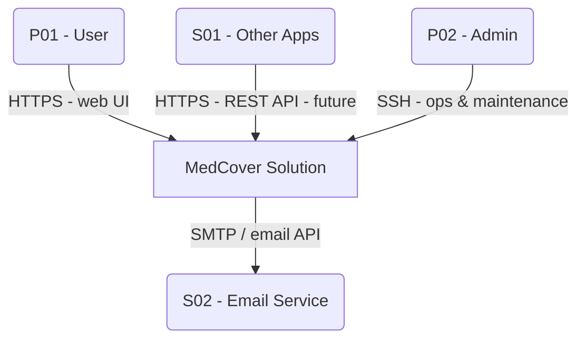
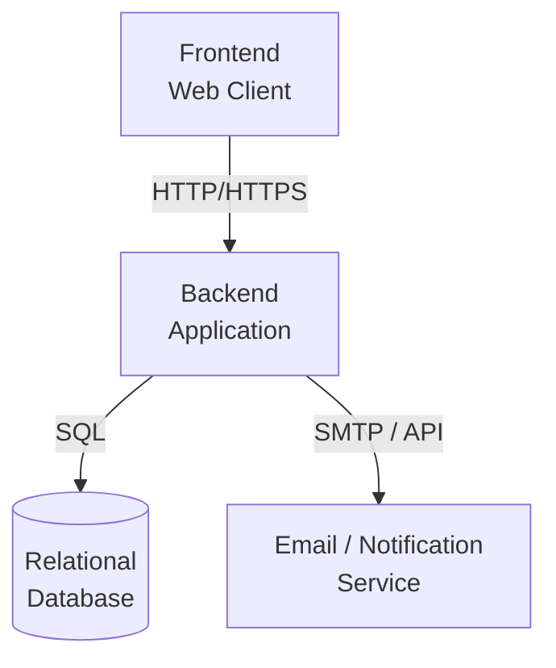
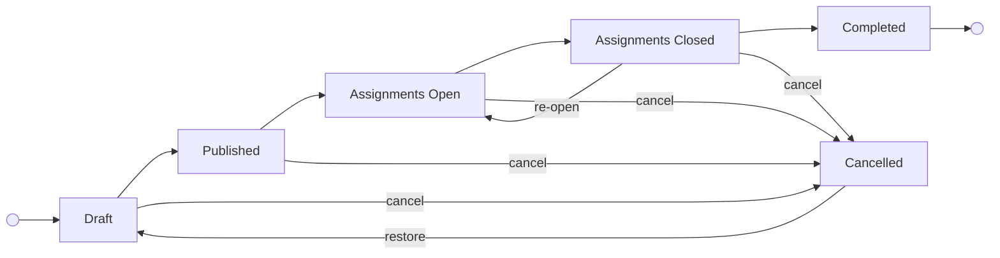
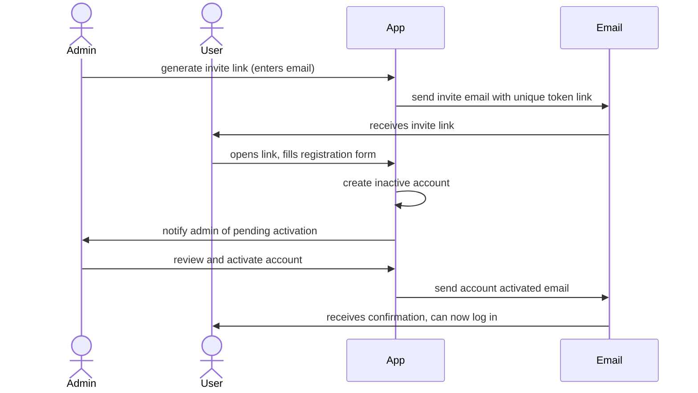
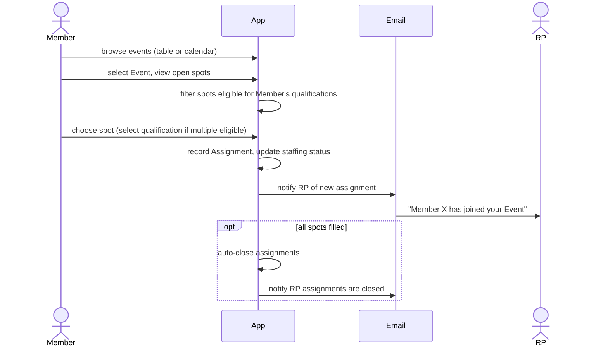
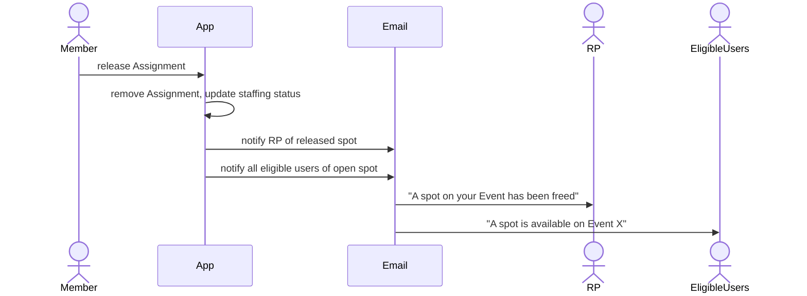
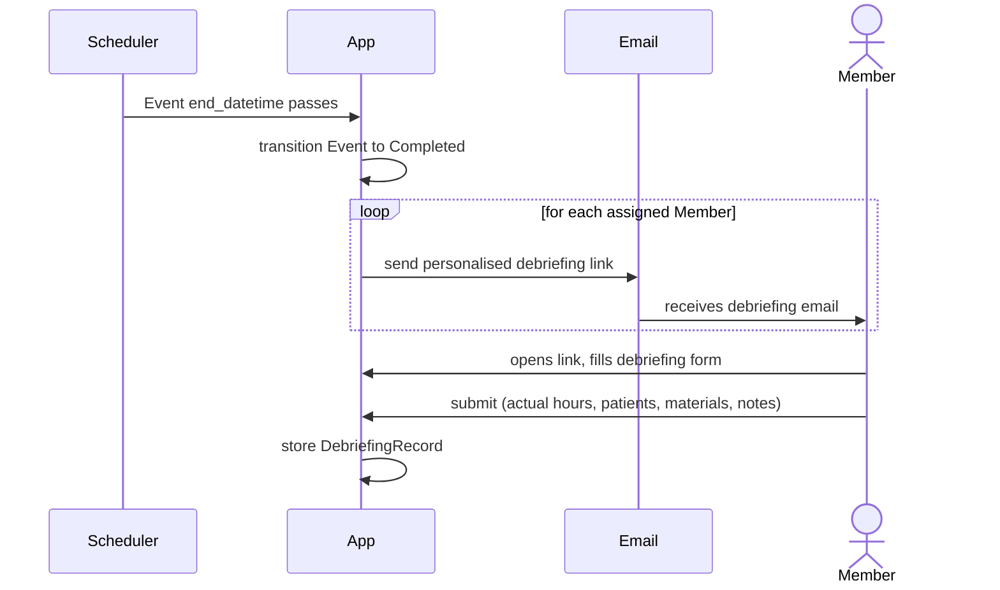
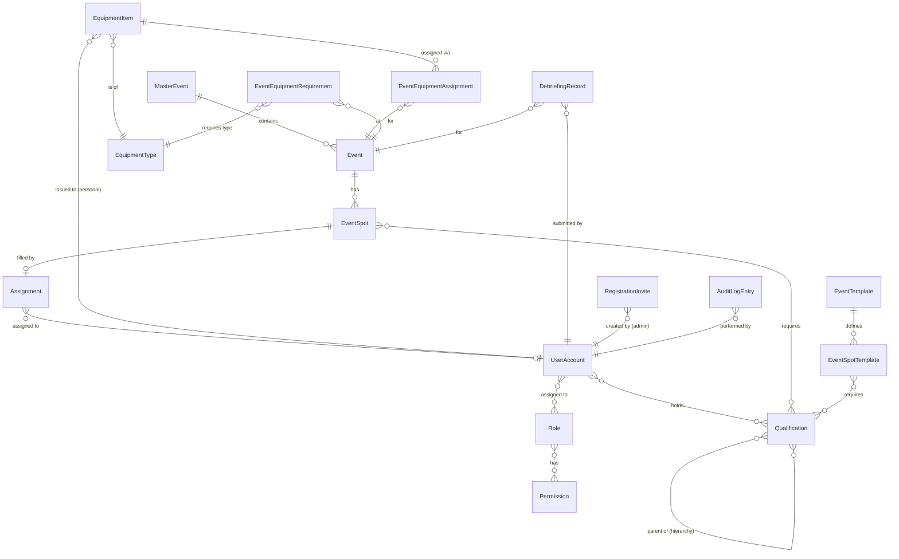

# MedCover Planner app

# MedCover Planner app

## Czech ↔ English Glossary

This table is the authoritative reference for domain terminology across the entire project.
All UI text is in **Czech**; all code identifiers (model names, field names, route names, permission codes) are in **English**.
When in doubt about the correct Czech UI label or English code name for a concept, consult this table first.

### Domain Objects

| Czech (UI) | English (code) | Notes |
|---|---|---|
| Akce | Event / `Event` model | An individual medical cover event |
| Nadřazená akce | Master Event / `MasterEvent` model | Groups related events for reporting; has a self-referential hierarchy |
| Šablona akce | Event Template / `EventTemplate` model | Reusable blueprint for creating events |
| Pozice | Spot / `EventSpot` model | A staffing position to be filled at an event |
| Šablona pozice | Spot Template / `EventSpotTemplate` model | Spot definition inside an `EventTemplate` |
| Přihlášení / Přihláška | Assignment / `Assignment` model | A member assigned to a specific spot |
| Kvalifikace | Qualification / `Qualification` model | Professional credential/certification that governs spot eligibility |
| Vybavení | Equipment | Collective term for items managed in the equipment module |
| Typ vybavení | Equipment Type / `EquipmentType` model | Category of equipment (e.g. AED, uniform) |
| Položka vybavení | Equipment Item / `EquipmentItem` model | A specific physical item of an equipment type |
| Debriefing | Debriefing Record / `DebriefingRecord` model | Post-event confidential per-participant feedback; "Debriefing" is used unchanged in Czech |
| Přehledový e-mail | Admin Digest / `AdminDigest` | Scheduled summary email sent to admins |
| Pozvánka | Invite / `RegistrationInvite` model | One-time invite link for a new user to register |
| Audit log | Audit Log / `AuditLogEntry` model | Immutable record of every create/edit/delete/status-change action |
| Záloha | Backup | Database backup file; route module `backup` |
| Nastavení | App Settings / `AppSettings` model | Global application configuration (SMTP, base URL, etc.) |

### People & Roles

| Czech (UI) | English (code) | Notes |
|---|---|---|
| Uživatel | User / `UserAccount` model | Any person with an account |
| Admin | Admin | System administrator role; can do everything except confidential debriefing |
| Koordinátor | Coordinator | Can create/manage events and assign staff |
| Člen | Member | Regular member; can join events and submit debriefings |
| Divák | Viewer | Read-only access |
| Vedoucí debriefingu | Debriefing Manager | Exclusive access to confidential debriefing records |
| Zodpovědný zdravotník (ZZ) | Responsible Person (RP) / `responsible_person` | The qualified medic leading an event on site; field: `Event.responsible_person_id` |
| Zelenáč | Trainee | Informal Czech term for a junior/trainee-level qualification used in the event import logic |

### Event Status (`EventStatus` enum)

| Czech (UI) | English code value | Meaning |
|---|---|---|
| Koncept | `DRAFT` | Visible to coordinators only; not accepting assignments |
| Zveřejněná | `PUBLISHED` | Public, assignments not yet open |
| Přihlášky otevřeny | `ASSIGNMENTS_OPEN` | Members can claim spots |
| Přihlášky uzavřeny | `ASSIGNMENTS_CLOSED` | Registration closed; event in progress |
| Dokončena | `COMPLETED` | Event finished; debriefing period begins |
| Zrušena | `CANCELLED` | Event cancelled; can be restored by coordinator |

### Staffing Status (computed, `Event.staffing_status`)

| Czech (UI) | Meaning |
|---|---|
| Žádné pozice | Event has no mandatory spots defined |
| Neobsazeno | No mandatory spots filled |
| Částečně obsazeno | Some but not all mandatory spots filled |
| Plně obsazeno | All mandatory spots filled |

### Spot & Qualification Attributes

| Czech (UI) | English (code) | Notes |
|---|---|---|
| Povinná pozice | Mandatory spot — `is_optional = False` | Affects staffing status calculations |
| Volitelná pozice | Optional spot — `is_optional = True` | Does not affect staffing status |
| Požadovaná kvalifikace | Required qualification — `EventSpot.required_qualifications` | M2M: qualifications a spot holder must have |
| Může být vedoucí akce | Can be RP — `Qualification.can_be_rp` | Holder is eligible to be set as `responsible_person` |
| Nadřazená kvalifikace | Parent qualification — `Qualification.parents` | Higher-tier qualification that can substitute for lower ones |
| Může zastoupit | Can substitute / `can_be_filled_by()` | A parent qualification holder can fill spots requiring a child |
| Smazáno (soft) | Soft-deleted — `is_deleted = True` | Qualifications are never hard-deleted; is_deleted hides them |

### Dates & Scheduling

| Czech (UI) | English (code) | Notes |
|---|---|---|
| Plánovaný začátek | Planned start — `start_datetime` | Scheduled event start |
| Plánovaný konec | Planned end — `end_datetime` | Scheduled event end |
| Skutečný začátek | Actual start — `actual_start_datetime` | RP-submitted actual start; used for billing |
| Skutečný konec | Actual end — `actual_end_datetime` | RP-submitted actual end; used for billing |
| Otevření přihlášek | Assignments open datetime — `assignments_open_datetime` | Auto-opens registration at this time; `NULL` = opens immediately on publish |
| Připomínky | Reminder schedule — `reminder_schedule` | Comma-separated list of hours-before-start to send reminders (e.g. `"24,48"`) |
| Počet ošetřených | Patients count — `patients_count` | RP-submitted; number of patients treated at event |

### Debriefing Concepts

| Czech (UI) | English (code) | Notes |
|---|---|---|
| Celkové hodnocení akce | Grade — `DebriefingRecord.grade` | 1 (Výborná) to 5 (Špatná) |
| Výborná / Velmi dobrá / Dobrá / Dostačující / Špatná | 1 / 2 / 3 / 4 / 5 | Grade labels |
| Hodnocení průběhu akce | Event feedback — `feedback_event` | Confidential evaluation of event execution |
| Hodnocení objednatele / organizátora | Customer feedback — `feedback_customer` | Confidential evaluation of the customer/organizer |
| Hodnocení kolegů | Colleagues feedback — `feedback_colleagues` | Confidential evaluation of teamwork |
| Nevyplněný debriefing | Pending debriefing | Assignment where `DebriefingRecord` does not yet exist |
| Část vedoucího zdravotníka (ZZ) | RP section | The non-confidential part of the debriefing form filled only by the responsible person |

### Equipment Concepts

| Czech (UI) | English (code) | Notes |
|---|---|---|
| Sdílené vybavení | Shared equipment — `EquipmentItem.is_personal = False` | Items assigned per-event (e.g. AED) |
| Osobní vybavení | Personal equipment — `EquipmentItem.is_personal = True` | Items issued long-term to a user (e.g. uniform) |
| Vydáno | Issued to — `issued_to` | Personal item currently held by a user |
| Výchozí úložiště | Home location — `home_location` | Where an item belongs when not in use |

### UI Actions & Navigation Labels

| Czech (UI) | English (code/route) | Notes |
|---|---|---|
| Akce (nav) | Events — `events.index` | Note: "Akce" means both "event" and "action" in Czech; context distinguishes |
| Nadřazené akce | Master Events — `master_events.index` | |
| Šablony akcí | Event Templates — `templates.index` | |
| Vybavení | Equipment — `equipment.items` | |
| Přehledy | Reports — `reports.index` | |
| Debriefing | Debriefing — `debriefing.index` | |
| Výkaz práce | Monthly work report / `work_report` blueprint | Pre-filled xlsx payroll document generated per user per month; contains worked hours for paid events |
| Uživatelé | Users — `users.index` | |
| Pozvánky | Invites — `users.invites` | |
| Audit log | Audit Log — `admin.audit_log_list` | |
| Kvalifikace | Qualifications — `qualifications.index` | |
| Přehled oprávnění | Permissions Overview — `admin.permissions` | |
| Přehledový e-mail | Admin Digest — `admin_digest.index` | |
| Záloha | Backup — `backup.index` | |
| Zpětná vazba | Feedback — `feedback.index` | |
| Nastavení | App Settings — `app_settings.index` | |

### Common Form Labels

| Czech (UI) | English (field name) |
|---|---|
| Název | `name` |
| Popis | `description` |
| Adresa / Místo konání | `address` |
| Kontaktní osoba | `contact_person` |
| Zodpovědný zdravotník | `responsible_person_id` |
| Placená akce | `paid` (boolean) |
| Archivovaná | `archived` (boolean) |
| Popis pozice | `EventSpot.description` |
| Výchozí zobrazení kalendáře | `preferred_calendar_view` |
| Pracovní úvazek | Employment type (always "DPP" in výkaz) |
| Popis činnosti | Activity description (event names column in výkaz) |
| Počet hodin | Hours count (výkaz column) |

### Terminology Ambiguities to Watch

| Situation | Rule |
|---|---|
| "Vedoucí" vs "Zodpovědný zdravotník (ZZ)" | Both refer to the on-site lead. Use **"Zodpovědný zdravotník"** (full form) in form labels and tables. "ZZ" is the accepted abbreviation. "Vedoucí" alone is acceptable in error badges/alerts for brevity (e.g. "Chybí vedoucí"). |
| "Pozice" vs "Místo" | **"Pozice"** is the standard term for an EventSpot in all headings and tables. "Místo" is used only in the fixed phrase **"Místo konání"** (venue/location of the event). |
| "Akce" (ambiguity) | Means both "event" (domain noun) and "action" (generic Czech word). In nav and UI always means Event. In button labels "Akce" with dropdown caret means actions menu. The context disambiguates. |
| "Přihlášení" vs "Přihláška" | Both are valid Czech for Assignment. "Přihlášení" is used as a verb noun (the act of joining); "Přihláška" as a noun (the registration). Both map to the `Assignment` model. |

### Overall Idea
- a web application for planning medical cover for Events
- developed by and to be primarily used by the Czech Red Cross organization
- the app shall replace the current Google Sheets app that is used for the same purpose and is reaching its limits
- the app shall meet all the current requirements and allow seamless transition

### Assumptions and Constraints

**Assumptions**
- The primary user base is Czech Red Cross members; UI language is Czech
- The application replaces an existing Google Sheets solution — a seamless transition is expected
- User adoption depends on ease of use; not all users are IT-proficient
- Events are coordinated by a small group of admins/coordinators; the majority of users are members or viewers

**Constraints**
- The project is maintained by a volunteer team; the project lead is the primary maintainer
- Technology choices must favour simplicity and long-term maintainability over feature richness
- Infrastructure costs should be kept low (volunteer/non-profit context)

## Functional Requirements
- Users administration:
    - app roles (authorization) - admin, coordinator, member, viewer
    - qualifications (unified model covering both medical qualifications and additional certifications — see AD07):
        - medical qualifications: Doctor, Nurse (SZP), First Aider (zdravotník), Trainee (zelenáč)
        - additional certifications: Driver, PSP training, KI training, humanitarian unit training, etc.
        - qualifications shall support a hierarchy tree, allowing a holder of a higher-ranked qualification to fill spots requiring a lower-ranked one (e.g. Doctor can fill a First Aider spot; KI-trained can fill a PSP spot)
        - qualifications and their hierarchy shall be manageable (create, edit, delete) through the application by users with appropriate permissions
    - member equipment — the user profile shall display organisation-owned items currently issued to the member (long-term dislocation, e.g. uniform, personal medikit). Managed via the equipment inventory model (see Equipment section).
    - phone number, email
    - reporting/overview section:
        - **per-user**: planned hours, actual worked hours, nearest upcoming Event, last attended Event, full Event history
        - **per Master Event**: total planned and worked hours, number of Events (completed / cancelled / open), total patients treated, medical materials used, attendance summary
        - **date-range report**: all Events within a configurable date range (e.g. a calendar year), aggregated across all MEs — this replaces any need for a "yearly" ME hierarchy
    - new User Registration shall be invite-only: an admin generates a unique registration link which is sent to the prospective user; only the holder of the link can register (see AD03)
    - a newly registered account shall require admin activation before the user can log in
    - users shall be able to reset their own password via a self-service email link ("forgot password" flow)
    - users shall be able to set a preferred calendar view (month, week, day, or list); this preference is stored per user and applied when they open the calendar on desktop; on mobile, list view is the default regardless of stored preference
- Master Event (ME):
    - the system shall allow grouping of related Events under an overarching Master Event entity
    - a default "General" Master Event shall exist; all Events are assigned to a ME (General by default)
    - admins/coordinators shall be able to create and edit custom Master Events
    - admins shall be able to archive Master Events to hide them from the default view; archived MEs remain accessible for historical reporting
    - the built-in "General" Master Event cannot be archived
    - the ME view shall provide an aggregated overview of all its Events: assignment status, worked hours, count of Completed / open / cancelled Events
- Event
    - Each Event shall have
        - lifecycle statuses
            - **Draft** — created but not yet visible to members
            - **Published** — visible to members but assignments not yet open
            - **Assignments Open** — members can register for spots
            - **Assignments Closed** — no new assignments; Event is staffed or closed by coordinator/RP
            - **Completed** — Event has taken place; debriefing phase begins
            - **Cancelled** — Event will not take place; archived (hidden from normal views but not deleted)
        - lifecycle transitions
            - Draft → Published: manual (coordinator/admin)
            - Published → Assignments Open: **automatic** at the configured assignment-opening date/time; can also be manually triggered or overridden by coordinator/admin
            - Assignments Open → Assignments Closed: **automatic** when all spots are filled; can also be manually closed by coordinator/admin or the RP
            - Assignments Closed → Assignments Open: manual re-open by coordinator/admin or RP (e.g. a person drops out and spots need to be re-opened)
            - Assignments Closed → Completed: **automatic** after the Event end date/time passes
            - Any non-Completed state → Cancelled: manual (coordinator/admin only)
            - Cancelled → Draft: manual restore (coordinator/admin) — allows reuse as a basis for a new Event
            - Completed Events cannot be cancelled
        - cancellation and archiving
            - a Cancelled Event is **archived** (hidden from default views) but not deleted
            - archived Events can be restored to Draft, or used as the basis for a new Event
            - admins can permanently delete archived Events
        - staffing statuses (derived, not manually set)
            - Not staffed
            - Partially staffed
            - Fully staffed
            - Overstaffed
    - Event management - Create, modify, cancel Events
    - Event templates
        - some Events are very similar, so the system shall provide Event templates to simplify creation of new Events (e.g. a simple Event requiring 1 First Aider and 1 Trainee; a larger Event requiring 2 First Aiders, 2 Trainees and an ambulance)
        - a template may include a reminder schedule (list of "X days/hours before start" reminder triggers) which is applied automatically when an Event is created from it
        - Event templates shall be manageable (create, edit, delete) by **admins and coordinators only**
    - parametrize Events
        - start date,
        - start time,
        - end date,
        - end time,
        - number of Patrols (hlídky zdravotníků) - 1 as a default, but can be more
        - required personnel (how many of each qualification or training kind are needed; multiple qualifications can be required for one spot - e.g. 1 First Aider who is also a Driver, 2 Trainees)
        - when a person assigned to an Event is eligible for multiple spots, the specific spot they will cover must be selected at assignment time
        - required equipment (ambulance, tent, PR material, etc.),
        - optional parameter for setting maximum personnel of each qualification or training
        - paid or unpaid Event
        - date/time of Assignments opening ("immediately" being the default) - some Events can be active but not open for Assignment
        - contact person, Event address
    - The Responsible Person mechanism:
        - Each Event shall have a Responsible Person (RP) assigned before the Event start date/time.
        - Typically the first First Aider who registers to an Event becomes the RP.
        - The RP can be assigned or changed by the coordinator/admin
        - Once the RP is assigned, he/she is responsible for managing the other personnel on that Event.
        - On Events that belong to a custom ME (for example large music festivals), when a new Event is created the ME coordinator is automatically pre-filled as the RP; the coordinator can later reassign the RP slot to another eligible member
        - The RP shall be notified about changes in the Event, for example users switching spots, or coordinator/admin changing some parameters of the Event
    - If someone removes his/her's Assignment from an Event, all users who fulfill the spot requirements will be notified about the new Assignment possibility/need. No approval from the RP is required to free a spot.
    - If the Event is nearing its start and still has unfilled spots, all eligible users shall receive escalating reminder emails; the reminder schedule is configurable per Event by a coordinator/admin (default: 1 reminder, 1 day before start). When an Event is created from a template, the template's reminder schedule is applied.
    - The users registered to an Event shall be able to release their Assignment at any time; no approval from the RP or anyone else is required (see AD06)
- Post-event Debriefing
    - after an Event reaches the Completed status, the system shall trigger a debriefing process for all assigned members
    - each member shall receive a personalised email link leading directly to their debriefing form
    - the debriefing form shall allow reporting:
        - actual worked hours (may differ from the planned Event duration — e.g. Event ended early, or the person only attended part of the Event)
        - number of patients treated
        - medical materials used
        - general feedback / notes
    - partial attendance shall be supported: a member may report they were present for only part of the Event duration
- Equipment
    - manage **equipment types** (e.g. AED, medikit, large medikit, training dummy, uniform, personal LED light, etc.); types are classified as either *personal* or *shared*
    - manage **equipment inventory** — individual physical items, each belonging to an equipment type:
        - **Personal equipment** (uniforms, personal lights, etc.) — items issued long-term to a specific member; remain with that member until explicitly returned (e.g. member leaves the organisation or item is destroyed); members can self-report their own personal equipment
        - **Shared equipment** (AEDs, medikits, training dummies, etc.) — items from a communal pool; assigned to Events for the duration of the event and then returned to inventory
    - **Event equipment planning**: when creating or editing an Event, a coordinator can specify how many items of each shared equipment type are required (e.g. "2× AED, 1× large medikit")
    - **Event equipment assignment**: before or during an Event, specific shared EquipmentItems from inventory are assigned to the Event (e.g. AED-1 and AED-red are assigned to Event #42); this records which physical items were used at each Event
- Display Events in a table or calendar with the following properties:
    - **Views**: month, week, day (calendar), and list/table view
    - **Interactive**: clicking a day slot in the calendar opens the Event creation form pre-filled with that date (Coordinators / Admins only)
    - **Colour coding**: Events are coloured by lifecycle phase (e.g. Draft, Published, Assignments Open, etc.); if the logged-in user is not eligible to join the Event — even if spots exist — the Event is shown in grey
    - **Default view**: shows all non-archived Events that are in a Published or later phase; filtering options (by ME, date range, etc.) are deferred to post-MVP
- Email notifications — **email only for MVP** (in-app notifications are on the wish list)
- Notifications should be customisable to prevent unnecessary spamming (configurable per Event and at the user level)
- Audit capability
    - all create, edit, delete and status-change actions on every entity shall be recorded (users, events, master events, assignments, equipment, qualifications, roles, debriefing records, system configuration)
    - each audit entry records: timestamp, actor (user account), action type, entity type, entity ID, and a summary of what changed (before/after values where applicable)
    - audit log is immutable — entries cannot be edited or deleted
    - the UI shall expose:
        - **per-entity timeline** — a chronological history of changes for a single entity (e.g. all changes to Event #42)
        - **global activity feed** — a filterable feed of all changes across the system, filterable by entity type, user, and date range
    - audit log access is restricted to admins (see RBAC table)

### Notification Triggers

| Trigger | Recipients | Timing |
|---|---|---|
| Spot released on an Event | RP (immediately) + all eligible users (immediately) | On event |
| User joins an Event (spot filled) | RP (immediately) | On event |
| Coordinator/admin changes Event parameters | RP (immediately) | On event |
| Unfilled spots as Event approaches | All eligible users | Configurable reminder schedule per Event (default: 1 day before start); inherited from template if applicable |
| Event Completed — debriefing | Each assigned member (personalised link) | On transition to Completed |
| User-set personal reminder | The individual user | At the user-configured time |
| Manual reminder by admin/coordinator/RP | Selected roles on a specific Event | On demand |
| Admin system digest | All admins | Adaptive: once/day normally; more frequent if many changes occur in a short window |
| Account pending activation | All admins | On user registration (immediately) |
| Registration invite | Invited email address | On admin action |
| Account activated | Newly activated user | On admin action |
| Password reset | Requesting user | On demand |

## Non-Functional Requirements
- The app must be user friendly and very easy to use - not all users are very skilled at IT
- There should be tooltips helping users use the app
- The app must be available 24/7
- The app must be accessible via Internet (public-facing)
- The app must have user authentication
- The app UI must be in Czech language
- The app UI must be optimized for both PC and mobile phone screens - most users will access the app using their mobile phones
- all changes must be logged and allow auditing - who changed what and when
- The infrastructure used by the app should allow backup/restore of the app. Daily backups with 60 days retention, 1day RPO, 12 hours RTO
- **Concurrent users:** The application must correctly handle **10 or more simultaneous users**. Race conditions — especially two users claiming the same EventSpot at the same time — must be prevented at the application level (row-level locking) and enforced at the database level (UNIQUE constraint). See AD12 for the concurrency strategy.

### Security Requirements

**Transport security**
- All traffic between end users and the application must be encrypted with TLS (HTTPS). Render.com handles TLS termination at the edge; no additional configuration is needed in the app itself.
- The connection between the application and PostgreSQL must use TLS (`sslmode=require`) in production. This is enforced via the `DATABASE_URL` environment variable in the production config.
- Container-to-container traffic within the same Render private network is isolated from the public internet (private service network, non-routable externally). We rely on Render's network isolation as the primary protection for intra-service traffic; DB SSL provides defence in depth. This is considered an acceptable risk for a non-critical internal application. If the deployment platform changes, this assumption must be re-evaluated.
- The web ↔ scheduler pair communicates only through the shared database (no HTTP calls between them), so no inter-service TLS is needed.
- We do **not** plan a multi-server / distributed deployment for MVP. If this changes, intra-cluster mTLS must be re-evaluated.

**CSRF protection**
- All state-changing HTTP requests (POST/PUT/DELETE) must be protected by CSRF tokens. Flask-WTF provides per-session CSRF tokens automatically when `WTF_CSRF_ENABLED = True`. See AD13.
- The `WTF_CSRF_ENABLED = False` override in `TestingConfig` is intentional and safe (tests only).

**Cross-site scripting (XSS)**
- Jinja2 auto-escapes all template variables by default. This must never be disabled. Use `{{ var | safe }}` only for explicitly trusted, admin-sourced HTML — never for user-supplied content.
- A `Content-Security-Policy` response header is added as additional defence (see AD14).

**SQL injection**
- All database access uses SQLAlchemy ORM with parameterised queries. Raw SQL via `db.engine.execute()` or `text()` with string interpolation is prohibited.

**Input validation strategy**
- **Server-side validation is the authoritative security control** and must always be present. Client-side validation is a UX enhancement only — it can be bypassed and must never be the sole check.
- Every user-submitted value must be validated server-side: type, length, range, format, and business logic constraints.
- Client-side: HTML5 constraint attributes (`required`, `type`, `maxlength`, `min`, `max`) provide immediate feedback. A lightweight JS validation layer (see AD14) runs before form submission to catch common errors and improve UX on mobile without a round-trip.

**Authentication and qualification security**
- Passwords are hashed with Werkzeug (`pbkdf2:sha256`). Plaintext passwords are never stored or logged.
- Password reset and invite tokens use `itsdangerous` TimedSerializer with a configurable expiry. Tokens are single-use.
- Registration is invite-only (AD03). No open self-registration exists.
- SMTP qualifications are Fernet-encrypted in the database. They are decrypted only at send time and never exposed in logs, API responses, or templates (AD11).
- `SECRET_KEY` must be a strong random value (minimum 32 bytes of entropy) in all non-dev environments. The dev default in `.env.example` must never be used in production.

## Architectural Decisions
- AD01 User Roles Customization
    - Problem statement - Should the user roles be hardcoded or customizable?
    - Decision - Hardcoded pre-defined roles, adding custom roles may be added to the app later
    - Justification - app roles are sets of permissions (see AD02)
      they are relatively stable and allow good testing. Custom roles may be added to the app later but at this point, for simplicity, only pre-defined roles will be used.

- AD02 Application Object Permissions
    - Problem statement - It is not known exactly how the user roles will look like in the final app. The app should allow granular permission assignment to roles to provide flexibility.
    - Options
        - Minimalistic approach - define only create/edit/view permissions per app module
        - Maximum flexibility - design the app in a way that each meaningful component/object/action will have a permission associated with it
    - Decision - Maximum flexibility
    - Justification
        - All objects in the application (such as Equipment, Event, Master Event, User) shall have permission objects assigned to it. This will allow granular permissions assignment to user roles. However, there will be only pre-defined RBAC roles (admin, coordinator, member, viewer) at this time. Custom roles may be implemented in the future, so the object based permission model should be prepared for this.
        - Admins and Coordinators should be able to edit all Events and change people assignment to Events. This should be useful if a person can't change their own reservation, an admin or coordinator can do it for them.
        - Example permissions:
            user.view
            user.edit
            Event.create
            Event.edit
            Event.cancel
            Event.publish
            Event.assign
            Event.set_responsible_person
            equipment_type.view
            equipment_type.edit
            equipment_type.create
            audit.view
            notification.send
            master_Event.view
            master_Event.edit
            master_Event.create
            master_Event.archive

- AD03 User Registration Access Control
    - Problem statement - Should new user self-registration be open to anyone, or should access be restricted?
    - Options
        - Open registration - anyone can register; account is activated after admin approval
        - Invite-only registration - new users can only register via a unique link generated by an admin
    - Decision - **Invite-only registration**
    - Justification - Prevents unsolicited registrations and bot attempts. Only people explicitly invited by an admin can create an account. Admin approval remains part of the flow (the invite link leads to a registration form; the resulting account is activated by admin).

- AD04 Technology Stack
    - Problem statement - Which technology stack should be used to implement the application?
    - Options
        - Python Flask + relational database + lightweight JavaScript frontend
        - Python Django + relational database + lightweight JavaScript frontend
        - Other frameworks / languages
    - Decision - **Python Flask + PostgreSQL + server-rendered HTML (Jinja2) + vanilla JS/jQuery**
    - Justification
        - Flask is lightweight and familiar to the project lead; keeps the codebase simple and easy for volunteers to contribute to
        - PostgreSQL provides robustness and production-grade reliability without significant operational overhead
        - Jinja2 server-rendered templates eliminate the need for a separate frontend build pipeline or SPA framework
        - Vanilla JS / jQuery is sufficient for the required interactivity (form enhancements, dynamic notifications); calendar views are handled by FullCalendar (see AD08)
        - This stack is well-supported on all considered hosting platforms (VPS, PythonAnywhere, Render, etc.)
    - Implications
        - REST API: can be added later using Flask blueprints without major architectural changes (auth mechanism TBD when REST API is scoped)
        - ORM: SQLAlchemy (standard Flask ORM for PostgreSQL)

- AD05 Authentication Mechanism
    - Problem statement - How should users authenticate to the application?
    - Options
        - Username + password (local accounts only)
        - Local accounts + social login (e.g. Google OAuth)
        - Single Sign-On via external identity provider (e.g. LDAP, Azure AD)
    - Decision - Username + password with email address as the login identifier
    - Justification - Simplest option to implement and maintain. No dependency on third-party identity providers. Social login or SSO may be revisited in the future if demand arises.
    - Notes
        - Users log in with their email address and a password
        - A self-service "forgot password" flow (password reset via email link) shall be provided
        - Password reset and initial account activation emails require the email/notification service to be operational

- AD06 Assignment Handover Mechanism
    - Problem statement - When a member can no longer attend an Event, how should the spot be handed over to someone else?
    - Options
        - **Explicit transfer** — the member selects a specific replacement; the replacement must confirm before the original member is removed. Requires both parties to act.
        - **Simple spot release** — the member frees the spot without selecting a replacement; the system notifies all eligible users; any eligible user can then self-assign. No bilateral coordination required.
    - Decision - **Simple spot release**
    - Justification - Operationally simpler and avoids requiring the replacement's approval. No coordination delay. The system handles notification to all eligible users automatically.

- AD07 Qualification and Training Hierarchy Model
    - Problem statement - Should medical Qualifications (Doctor, Nurse, First Aider, Trainee) and additional Trainings (Driver, PSP, KI, humanitarian unit, etc.) be modelled as separate entities, or as a single unified hierarchy?
    - Options
        - **Separate entities** — Qualifications carry a medical hierarchy; Trainings are independent certifications with no hierarchy between them or with Qualifications.
        - **Unified hierarchy tree** — a single entity type with a parent–child hierarchy covering both Qualifications and Trainings (e.g. KI-trained can fill a PSP-trained spot; Doctor can fill a First Aider spot).
    - Decision - **Unified hierarchy tree**
    - Justification - A unified tree naturally models cross-category substitution (e.g. a KI-trained volunteer filling a PSP spot, a Doctor filling a First Aider spot) without requiring special-case logic. Eliminates duplication in spot requirements. Slightly more complex to model initially but more flexible long-term.
    - Notes
        - The entity will be called **Qualification** (or **Qualification**) to cover both medical levels and additional certifications
        - A Qualification may have zero or more parent Qualifications whose holders can fill spots requiring it
        - Examples: Doctor > Nurse > First Aider > Trainee; KI-training > PSP-training

- AD08 Calendar UI Component
    - Problem statement - The application requires a full event calendar with month, week, day, and list views, interactive day-click to create events, and per-event colour coding. Should this be built from scratch or fulfilled by a third-party library?
    - Options
        - **Build from scratch** (vanilla JS / jQuery) — write all calendar grid logic, view switching, and touch handling manually.
        - **FullCalendar** (open-source, MIT licence) — a widely-used JS calendar library delivered via CDN; no build pipeline required.
    - Decision - **FullCalendar**
    - Justification
        - All required views (month, week, day, list) are built-in; no custom grid logic needed.
        - Interactive day-click (`dateClick` / `select` callbacks) and per-event colour coding are first-class features.
        - Touch-aware out of the box; swipe-to-navigate works on phones.
        - MIT-licensed, actively maintained, extensive documentation — volunteer contributors can find tutorials and examples easily.
        - Delivered via CDN — no build pipeline or npm dependency management required, consistent with the project's simplicity goal.
        - Building equivalent functionality from scratch would take weeks and be harder to maintain long-term.
    - Notes
        - **Mobile default view**: on small screens (phones) the list view shall be the primary default; month/week/day remain accessible but secondary. On desktop the user's preferred view is stored as a personal setting (user preference in the database).
        - Only the free open-source distribution is used; the paid "Scheduler" add-on (drag-and-drop resource scheduling) is not required.
        - FullCalendar fetches events from a lightweight JSON endpoint served by the Flask backend.

- AD09 Deployment Platform and Containerisation Strategy
    - Problem statement - Where should the application be hosted, and how should it be packaged for deployment? The choice must balance simplicity, cost (non-profit context), portability, and reproducibility.
    - Options
        - **Platform-specific deployment** (e.g. PythonAnywhere, Heroku buildpacks) — simple setup but tightly coupled to the platform; migration is painful.
        - **Container-first deployment** (Docker) — application packaged as a container image; deployable to any container-capable platform with no code changes.
    - Decision - **Container-first (Docker) deployment on Render.com for MVP; targeting a hyperscaler with NGO credits long-term**
    - Justification
        - A `Dockerfile` decouples the application from the hosting platform — migrating from Render to Azure or Google Cloud requires no application changes.
        - Docker Compose provides a consistent local development environment for all contributors, reducing "works on my machine" issues.
        - Render.com supports Docker natively (push to GitHub → auto-deploy), has a free tier covering MVP needs, and includes managed PostgreSQL.
        - Czech Red Cross qualifies as an NGO for cloud credit programmes (Azure for Nonprofits ~$3,500/year; Google Cloud for Nonprofits ~$10,000/year); applying after MVP launch unlocks production-grade infrastructure at zero cost.
        - Container-first is the industry standard and familiar to most developers, making it easier for future volunteers to contribute.
    - Notes
        - **MVP target**: Render.com free tier (Flask container + managed PostgreSQL 256 MB). Free tier apps sleep after 15 minutes of inactivity — acceptable given the usage pattern (event-driven, not 24/7).
        - **Long-term target**: Azure Container Apps or Google Cloud Run using NGO credits; same `Dockerfile` applies.
        - **Local development**: Docker Compose with Flask app + PostgreSQL containers; `.env` file for secrets (not committed).
        - **CI/CD**: GitHub Actions builds and pushes the image; Render or the target platform pulls and deploys automatically.
        - The Deployment Model section should be updated once the NGO credit application is approved and a hyperscaler is chosen.

- AD10 Background Task / Scheduler Architecture
    - Problem statement - The application requires background processing: scheduled email reminders, automatic Event lifecycle transitions (Published → Assignments Open, Assignments Closed → Completed). How should this be implemented?
    - Options
        - **APScheduler inside Flask process** — runs in-process; simple but last release was 2023; unsafe with multi-worker Gunicorn; Flask crash kills scheduler.
        - **Celery + Redis** — industry-grade distributed task queue; robust retries and monitoring; requires a Redis broker container (additional cost and operational complexity).
        - **Separate scheduler container** — a second lightweight Docker container running a simple Python script (`schedule` library); shares the same codebase; Flask and scheduler are independently restartable.
        - **Same container, two processes** (supervisord) — Flask + scheduler colocated; antipattern for containers; harder to debug.
    - Decision - **Separate scheduler container**
    - Justification
        - Clean separation: Flask serves web requests; scheduler handles background work independently.
        - `schedule` library is actively maintained (2024), has no external dependencies, and is trivially simple for volunteers to understand and extend.
        - Render.com background workers are free-tier eligible and deploy from the same repo.
        - Avoids Redis (no 3rd container, no extra cost, no extra ops).
        - Same `Dockerfile` base image; scheduler container just runs a different command.
    - Notes
        - Scheduler tasks for MVP: (1) auto-transition Events at `assignments_open_at` datetime; (2) auto-close Events after `end_datetime`; (3) send reminder emails per `reminder_schedule`; (4) send admin digest emails.
        - Scheduler polls the DB every 60 seconds; no message broker needed at this volume.
        - See DEVOPS.md for container layout and `render.yaml` Blueprint.

- AD11 Application Configuration Storage
    - Problem statement - The application requires runtime configuration (SMTP qualifications, organisation name, timezone). Where should these be stored, and how should the app behave on first install?
    - Options
        - **Environment variables only** — simple; requires SSH/redeploy to change; no audit trail; qualifications in `.env` files on the server.
        - **Database-backed settings + setup wizard** — settings stored in a dedicated `AppSettings` table; changeable through the Admin UI without touching the server; supports a first-run wizard for guided setup.
    - Decision - **Database-backed settings with first-run setup wizard**
    - Justification
        - SMTP qualifications and other operational settings are more naturally managed by an application-level admin than by a server operator editing environment files.
        - A first-run wizard provides a guided, safe path to a working installation without requiring any SSH access.
        - Storing qualifications in the DB (encrypted) rather than environment variables avoids accidental exposure in CI logs, `.env` files, or Docker inspection output.
        - The `DATABASE_URL` and `SECRET_KEY` must remain as environment variables since they are needed to boot the application before any DB connection can be established.
    - Notes
        - SMTP password is stored Fernet-encrypted using a key derived from `SECRET_KEY` (AES-128 in CBC mode with HMAC); decrypted only in-process at send time.
        - `AppSettings` is a single-row table (id=1); `get_settings()` is idempotent and creates the row on first call.
        - Flask-Mail config (`MAIL_*`) is refreshed from the DB on every request via `before_request`; no redeploy required to change SMTP settings.
        - The setup wizard is blocked to all other endpoints via a `before_request` guard until `setup_complete=True`.
        - Audit log records all changes to `AppSettings` (action_type: `edit`, entity_type: `AppSettings`).

- AD12 Concurrency Control Strategy
    - Problem statement - The application is used by 10 or more people simultaneously. Without explicit concurrency controls, two users could claim the same EventSpot at the same time, or two admins could overwrite each other's edits to the same Event or UserAccount.
    - Options
        - **No explicit control** — rely solely on the DB UNIQUE constraint on `assignment.spot_id`; second insert fails at the DB level. Simple but produces a raw DB error with no user-friendly handling, and does not cover non-assignment conflicts.
        - **Pessimistic locking (SELECT FOR UPDATE)** — lock the target row at the start of the transaction; all other transactions block until the lock is released. Guarantees correctness; adds a brief serialisation bottleneck per contended row.
        - **Optimistic locking (version column)** — add a `version` integer to each entity; increment on every write; if the version read at fetch time no longer matches at write time, raise a conflict error. Zero blocking; fails fast on conflict; suitable for low-contention edits.
        - **Application-level queuing** — serialize all assignment requests through a queue. Overkill for expected load; adds infrastructure.
    - Decision - **Hybrid: pessimistic locking for spot assignment; optimistic locking for general entity edits**
    - Justification
        - Spot assignment is the highest-contention operation (many eligible users can see and claim the same spot simultaneously) and must be correct — pessimistic locking with `query.with_for_update()` ensures only one transaction proceeds at a time.
        - General entity edits (Event, MasterEvent, UserAccount, AppSettings) have much lower contention; optimistic locking with a `version` column is sufficient and avoids unnecessary blocking.
        - The DB UNIQUE constraint on `assignment.spot_id` is retained as a last-resort safety net but is **not** relied upon as the primary mechanism.
    - Implementation notes
        - Spot assignment: `EventSpot.query.filter_by(id=spot_id).with_for_update().one()` inside an explicit transaction; check assignment is still `None` after acquiring lock; create `Assignment`; commit.
        - Optimistic locking: add `version = db.Column(db.Integer, default=0, nullable=False)` to contended models; use SQLAlchemy's `version_id_col` mapper argument or manual increment; catch `sqlalchemy.exc.StaleDataError` and return HTTP 409 with Czech message "Záznam byl mezitím změněn. Načtěte stránku znovu.".
        - Implement before any Phase 2 assignment logic is written.

- AD13 Transport Security and Container Networking
    - **Status:** Decided
    - **Context:** The application is deployed as multiple containers (web, scheduler, database). The question is: what encryption and isolation is needed for traffic between containers, and is TLS between containers necessary?
    - **Decision:**
        1. **External traffic (user ↔ web):** TLS is terminated at Render's edge proxy. No in-app TLS configuration needed.
        2. **Web ↔ PostgreSQL:** TLS (`sslmode=require`) is enforced via `DATABASE_URL` in production. The `ProductionConfig` asserts this. Dev/test use plaintext (acceptable; no real data).
        3. **Web ↔ Scheduler:** These containers communicate exclusively through the shared database. No HTTP calls exist between them. No inter-service TLS is needed.
        4. **Container-to-container isolation:** Render's private service network (`.internal` hostnames) is non-routable from the public internet. We rely on this network isolation as the primary protection for intra-service traffic. We do **not** implement mTLS between containers — it is not justified for a single-region, non-distributed, non-critical internal app of this scale.
        5. **If deployment platform changes:** The transport security assumptions must be re-evaluated. A cloud platform with a true VPC and private subnets (AWS, Azure, GCP) provides equivalent or stronger isolation.
    - **Consequences:** Simple deployment with no certificate management overhead inside the cluster. DB SSL adds a small handshake overhead (negligible). If a future requirement demands zero-trust networking, mTLS (e.g. via a service mesh) can be added without application code changes.

- AD14 CSRF Protection and Input Validation
    - **Status:** Decided
    - **Context:** All state-changing routes (POST/PUT/DELETE) are vulnerable to Cross-Site Request Forgery without token protection. Plain HTML forms without CSRF tokens allow a malicious page to submit requests on behalf of a logged-in user. Additionally, user-supplied inputs must be validated both on the client (UX) and server (security).
    - **Decision:**
        1. **CSRF:** Use **Flask-WTF** (`flask-wtf` package) with `WTF_CSRF_ENABLED = True` in all non-test configs. Flask-WTF injects a `csrf_token()` into every form automatically. All POST forms include `{{ csrf_token() }}` as a hidden input. The AJAX endpoint for FullCalendar event creation will send the token in the `X-CSRFToken` request header.
        2. **Server-side validation:** Every route that accepts user input validates all fields server-side (type, length, range, format, business logic). This is the authoritative security control. Client-side checks are never the only validation.
        3. **Client-side validation:** HTML5 constraint attributes (`required`, `type`, `maxlength`, `min`, `max`) provide immediate feedback. A lightweight vanilla-JS validation module (`app/static/js/validate.js`) runs `submit` event handlers on all forms to check common constraints (required fields, date ordering, numeric limits) before the request is sent, improving UX especially on mobile without a server round-trip.
        4. **XSS:** Jinja2 auto-escape is always on. `{{ var | safe }}` is prohibited for user-supplied content. A `Content-Security-Policy` header (`default-src 'self'; script-src 'self' cdn.jsdelivr.net; style-src 'self' cdn.jsdelivr.net`) is added via a `@app.after_request` hook in non-dev environments.
        5. **SQL injection:** All DB access via SQLAlchemy ORM. Raw `text()` with f-strings is prohibited.
    - **Consequences:** Small overhead: every form requires `{{ csrf_token() }}` in the template and Flask-WTF registered on the app. AJAX calls require the token header. The `validate.js` module must be kept in sync with server-side rules (duplication accepted; server rules are authoritative).

- AD15 Outbound Email Delivery Strategy
    - **Status:** Decided
    - **Context:** The application sends several categories of outbound email (assignment confirmations, event lifecycle notifications, coordinator reminders, admin digest). In the original design, every route that triggered an email called the SMTP relay synchronously within the HTTP request. This creates three problems: (1) SMTP latency adds to request latency visible to the user; (2) bulk sends (e.g. event cancelled → notify all 20 assigned users) risk exceeding relay rate limits and getting the sender IP/account blocked; (3) transient SMTP failures silently drop emails with no retry.
    - **Options considered:**
        - **Direct synchronous send** — simple but fragile; all three problems apply.
        - **Celery + Redis broker** — production-grade, full retry semantics, but introduces two additional services (Celery worker, Redis) that increase operational complexity significantly for a low-volume app.
        - **DB-backed outbox queue drained by the scheduler** — the scheduler container already exists (AD10); adding a queue table and a drain job requires no new infrastructure.
    - **Decision:** **DB-backed outbox queue** (`outbox_email` table).
        - All `send_*` helpers in `app/mail.py` write a `pending` row to `outbox_email` using `db.session.flush()` (no separate commit; the caller's transaction commits the row atomically with other DB changes).
        - The scheduler runs `process_email_queue()` every `MAIL_QUEUE_INTERVAL_SECONDS` (default **6 seconds ≈ 10 emails/min**), safely under the MS365 / typical relay limit of 30/min.
        - Each job run picks the single oldest `pending` row (`ORDER BY created_at ASC`), locks it with `SELECT … FOR UPDATE SKIP LOCKED` to prevent double-processing, sends it, then marks it `sent`.
        - On SMTP failure: `retry_count` is incremented; the row stays `pending` until `retry_count >= MAX_RETRIES` (3), at which point `status` is set to `failed` for admin inspection.
        - `MAIL_QUEUE_INTERVAL_SECONDS` is an environment variable so the throttle can be tuned per deployment without a code change.
    - **Consequences:**
        - User-triggered emails (e.g. "you were assigned") arrive with a few-second delay instead of instantly — acceptable for this use case.
        - Bulk sends are automatically spread over time, eliminating burst rate-limit risk.
        - `outbox_email` rows provide a permanent delivery audit trail viewable by admins.
        - The scheduler's main loop sleep was reduced from 30 s to 5 s so the queue is drained promptly.

- AD16 Google Sheets Event Import Strategy
    - **Context:** The app replaces an existing Google Sheets ("Dozory") workflow. At launch, ~130 future events must be migrated without manual re-entry. A one-off migration path is needed; the GS sheet continues to be used as the booking source until all coordinators move to MedCover natively.
    - **Options considered:**
        - **Google Sheets API** — no download step, but requires OAuth credentials, API quota management, and a persistent integration that would be dead weight after migration.
        - **CSV export** — simple, but the GS CSV export has inconsistent line endings that break standard parsers.
        - **xlsx via openpyxl** — preserves native date/time Python objects, handles merged cells gracefully, zero server-side dependencies.
    - **Decision:** **Two-step offline import using xlsx + JSON paste.**
        1. Admin downloads the sheet as `.xlsx` and runs `scripts/import_events.py` locally (requires `pip install openpyxl`). The script filters past events, maps GS columns to the MedCover JSON interchange format, and auto-appends dates to disambiguate duplicate names.
        2. Admin pastes the JSON into `/import/events/` (admin-only, `event.create` permission). The web app validates each row, fuzzy-matches responsible-person names against DB users, flags duplicates (same name + date already in DB), and renders an editable preview table.
        3. Admin reviews and confirms. All events are created in a **single all-or-nothing transaction** as `DRAFT`. 3 spots per event (1 mandatory Zdravotník, 1 mandatory Zelenáč, 1 optional Zelenáč) unless start time was missing.
    - **Bulk lifecycle actions (companion feature):** A `POST /events/bulk` route enables multi-select in the events list and batch status transitions (Zveřejnit, Otevřít přihlášky, Zrušit). Bulk actions intentionally skip email notifications to prevent notification storms when publishing a large import batch. Individual status changes via the event detail page still send emails.
    - **Column mapping (GS → MedCover):**
        - A (name), B (date), C (location), G (start_time), H (end_time), K (paid), M (responsible_person) → dedicated fields
        - D (vehicle/tent), E (event type), F (organiser contact), N+ (pre-import signups) → stored as text in `description`
    - **Consequences:**
        - No permanent GS integration to maintain.
        - The script is idempotent; duplicate detection in the web app prevents double-imports.
        - Responsible-person matching is best-effort (exact → case-insensitive → reversed "Lastname Firstname"); unmatched names are highlighted for manual correction in the preview.
        - Bulk status transitions make post-import workflow (publish all, open assignments) feasible in seconds.

- AD17 Role-Based Email Notification Matrix
    - **Context:** The app sends several categories of outbound email. As real user accounts are imported from external sources (Google Sheets) before users are aware of the app, uncontrolled email delivery to all users is a risk. A clear policy is needed for which roles receive which notification types, and what the Viewer role means in the context of email.
    - **Decision:** Email notifications are gated by role. The mapping is:

        | Notification type | Admin | Coordinator | Member | Viewer |
        |---|---|---|---|---|
        | Daily admin digest | ✓ | — | — | — |
        | Event published / assignments opened | — | ✓ | ✓ | — |
        | Assignment confirmed / released | — | — | ✓ | — |
        | Unfilled spot reminder (RP) | — | ✓ | ✓* | — |
        | Invite / password reset / account activation | ✓ | ✓ | ✓ | ✓ |

        *\*Member receives unfilled-spot reminders only when they are the Responsible Person of the event.*

    - **Viewer role constraints (additional):**
        - Viewer is the **minimum role** for accessing the application. Viewers can read most data but cannot be assigned to event spots.
        - **Member is the minimum role for event participation** (spot assignment, RP designation). This is enforced at the model/route layer when claiming spots and when setting `event.responsible_person`.
        - Because Viewers cannot hold spots, they can never be RP, which eliminates any ambiguity about RP-targeted emails for Viewer-only accounts.
        - If a user holds *only* the Viewer role, they receive **no operational emails** (only auth emails: invite, password reset, activation). This makes the Viewer role suitable for imported accounts not yet onboarded.
        - If a user holds Viewer **plus at least one other role**, the other roles determine notification eligibility (Viewer does not suppress).
    - **Dev/staging safety net:** A separate `dev_email_block` toggle in AppSettings (see AD15 / admin settings) allows blanket suppression of all non-allowlisted emails on dev instances. This is independent of role-based gating and acts as a last line of defence.
    - **Consequences:**
        - No per-user notification preferences needed for MVP; role assignment is the control knob.
        - Imported users given only the Viewer role are safe from operational spam until they are properly onboarded and given a Member role.
        - Role-based logic must be applied at every `send_*` call site (not just the outbox drain) so that changes to a user's roles take effect before the email is even enqueued.

- AD18 Multi-Version Python Testing with Tox
    - **Context:** The application runs on Python 3.14. New CPython releases arrive roughly annually. Without a structured testing strategy, compatibility regressions with new Python versions are discovered late (at upgrade time, under pressure).
    - **Decision:** Use **tox** to run the full `pytest` suite against multiple Python interpreter versions.
    - **Configuration:**
        - `pyproject.toml` `[tool.tox]` section defines the env list. Python 3.14 is the minimum and current baseline (`py314`).
        - New envs (e.g. `py315`, `py316`) are added here as new CPython releases become available and are installed on the host.
        - Each tox env installs exact pinned deps from `requirements-dev.txt` (`skip_install = true` because the app is not an installable package).
        - `tox` is listed in `requirements-dev.in` so it is installed in the dev virtualenv.
    - **Local usage:** `tox -e py314` (or just `tox` to run all configured envs).
    - **CI:** the existing GitHub Actions workflow runs `pytest` directly against the default Python; a future step can invoke `tox` once additional Python versions are available on the CI runner.
    - **Consequences:**
        - Compatibility issues with new Python versions are surfaced immediately after adding a new env, rather than at deployment time.
        - The `requirements-dev.txt` pinned file may need to be recompiled when a new Python version is added (some packages ship version-specific wheels).

MedCover is a standard three-tier web application:

- **Frontend** — a browser-based web client accessed over the public Internet. Optimised for both desktop and mobile screens.
- **Backend** — a server-side application exposing a web UI (and optionally a REST API). It implements all business logic, enforces RBAC, and manages application state.
- **Data store** — a relational database holding all persistent application data (users, events, equipment, audit log, etc.).
- **Email / notification service** — an outbound mail integration for sending notifications, reminders and digests to users.

All user interactions flow through the backend; the data store and mail service are internal dependencies not directly exposed to users. The infrastructure administrator (P02) accesses the server directly for operational tasks (deployment, backup, maintenance).

## System Context
The System Context describes how MedCover fits into the broader landscape of users, services and external systems around it.

| Entity ID | Entity Type | Entity Name | Description | Trust Level |
|---|---|---|---|---|
| P01 | Person | User | Czech Red Cross members accessing the app via a web browser over the public Internet | Authenticated; access controlled by RBAC |
| S01 | System | Other Apps | **Future** — third-party systems integrating via the REST API (e.g. reporting tools) | Authenticated via API token; read-only scope initially |
| P02 | Person | Infrastructure Admin | Person responsible for deployment, backups, OS/app updates and server maintenance | Trusted; accesses the server directly via SSH — outside the app's own auth |
| S02 | System | Email Service | External SMTP relay or email API (e.g. SendGrid, Mailgun, AWS SES) used for all outbound notifications | Outbound only; qualifications stored in database (encrypted), managed by admin via Settings UI |

**Trust boundaries:**
- All P01 traffic crosses the public Internet and must be served over HTTPS
- S02 qualifications (SMTP/API keys) must never be exposed to P01 users; they are stored encrypted in the database and are only configurable by users with the `admin.manage_settings` permission
- P02 SSH access must be restricted to authorised IP addresses or key-based authentication
- S01 API tokens must be scoped to minimum required permissions and revocable

## Component Model

### Logical Components

| Component | Responsibility |
|---|---|
| **Frontend Web Client** | Server-rendered HTML pages (Jinja2 templates) with vanilla JS/jQuery for interactivity. Served directly by the Flask application. Optimised for desktop and mobile. |
| **Backend Application** | Python Flask application. Implements all business logic, RBAC, event lifecycle, assignment management, qualification matching, notification triggers, audit logging, scheduled tasks. Serves the web UI via Jinja2 templates and will expose a REST API (future). Uses SQLAlchemy as the ORM. |
| **Relational Database** | PostgreSQL. Persistent storage for all domain data: users, roles, qualifications, master events, events, event spots, assignments, equipment, audit log, notification settings, debriefing records. |
| **Email / Notification Service** | Outbound email delivery: invite links, account activation, password reset, event notifications/reminders, admin digests, debriefing links. May be an external SMTP relay or third-party email API. |

## Runtime / Interaction View

### Event Lifecycle State Machine

**Notes:**
- Cancelled Events are **archived** (hidden from default views, not deleted). Admins can permanently delete archived Events.
- A Completed or Cancelled Event can serve as the basis for creating a new Event (copy/template flow).
- Staffing status (Not staffed / Partially staffed / Fully staffed / Overstaffed) is a **derived** status updated whenever assignments change; it is not a separate lifecycle state.

### Automatic Transitions (Background Processing)
The following transitions require a scheduled background job or task:
- **Published → Assignments Open**: triggered at the configured `assignments_open_at` datetime
- **Assignments Closed → Completed**: triggered after the Event `end_datetime`
- **Urgent fill notification**: reminder emails sent to eligible users at each offset in the Event's reminder schedule

The following happen in real time as a side effect of a user action:
- **RP pre-fill on Event creation**: when an Event is created inside a custom ME, the ME coordinator is automatically set as the initial RP; the coordinator or admin can later change this
- **RP auto-assignment (General ME)**: when the first user holding a First Aider (or higher) qualification registers for an Event that has no RP yet, they are automatically set as the RP
- **Assignments auto-close**: when the last unfilled spot is taken, lifecycle transitions to Assignments Closed
- **Staffing status update**: recalculated whenever an Assignment is added or removed

### Spot Selection at Assignment Time
An Event requires 1 Doctor, 1 Driver/First Aider and 1 First Aider. A user who holds both Doctor and Driver qualifications must explicitly choose which spot they are filling when registering. The system shall present only the spots the user is eligible for and require a selection before confirming the assignment.

### User Registration Flow

### Event Assignment Flow

### Spot Release Flow

### Post-Event Debriefing Flow

## Data View

### Core Domain Model

### Key Entities and Their Data

| Entity | Key attributes | Notes |
|---|---|---|
| **UserAccount** | email, password hash, name, phone, active flag, preferred_calendar_view | Email = login identifier; accounts inactive until admin-activated |
| **Role** | name, description | Pre-defined: Admin, Coordinator, Member, Viewer |
| **Permission** | code (e.g. `event.create`) | Object-level permissions assigned to roles |
| **Qualification** | name, description, parent qualifications | Unified model for medical qualifications and training certifications |
| **MasterEvent** | name, description, coordinator, archived flag | Default "General" ME always exists and cannot be archived |
| **Event** | name, start/end datetime, lifecycle status, staffing status, assignments_open_at, paid flag, contact, address | Belongs to a MasterEvent |
| **EventSpot** | required qualifications (list), assignment | One spot = one person |
| **Assignment** | user, spot, selected qualification | Records which qualification the user is covering for this spot |
| **EventTemplate** | name, description, spot templates | Pre-populates Event creation form |
| **EventSpotTemplate** | event template, required qualifications (list) | Defines one spot position within an EventTemplate |
| **EquipmentType** | name, description, category (personal / shared) | Defines a category of equipment (e.g. AED, medikit, uniform) |
| **EquipmentItem** | name, type, home location | For *personal* items: issued_to (UserAccount); for *shared* items: assignable to Events via EventEquipmentAssignment |
| **EventEquipmentRequirement** | event, equipment type, quantity required | Coordinator specifies how many of each shared type are needed for an Event |
| **EventEquipmentAssignment** | event, equipment item | Records which specific shared items were actually brought to an Event |
| **DebriefingRecord** | event, user, actual hours, patients treated, materials used, notes | Submitted after Event completion; one record per assigned user |
| **RegistrationInvite** | token, email, created by, expires at, used flag | Invite-only registration; single-use link |
| **AuditLogEntry** | timestamp, actor (user), action, entity type, entity id, change detail | Immutable; records all significant changes |
| **AppSettings** | org_name, timezone, smtp_server/port/tls/username/password (encrypted), smtp_default_sender, setup_complete | Single-row table; SMTP password stored Fernet-encrypted using SECRET_KEY; managed via Setup Wizard and Admin Settings UI |

### Data Store
- Single **relational database**: **PostgreSQL** (see AD04)
- All domain data is stored in one database; no separate read replicas or caches planned for MVP
- Audit log is append-only and stored in the same database

### Retention and Privacy
- Personal data (name, email, phone) is subject to GDPR as the organisation operates in the Czech Republic
- Audit log entries are retained indefinitely (required for accountability)
- Event and debriefing data: retained indefinitely for statistical purposes
- Equipment records: retained while items exist in inventory
- Backup retention: 60 days (as stated in Non-Functional Requirements)

## Integration Model

### Outbound Email
- The backend sends all email via an **external SMTP relay** (e.g. SendGrid, Mailgun, AWS SES, or the organisation's own SMTP server)
- Communication: SMTP (port 587/465) or provider HTTP API
- SMTP qualifications are stored **encrypted in the database** (Fernet/AES-128, key derived from `SECRET_KEY`) and managed by an admin user through the Settings UI — not stored in environment variables or config files
- Use cases: user invite links, account activation, password reset, event notifications/reminders, admin digest emails, post-event debriefing links
- Failure handling: email delivery failures shall be logged; critical flows (invite, password reset) should surface errors to the admin/user where possible

### REST API (External Integration)
- The backend shall expose a **REST API** to allow future integration with other systems (S01)
- Protocol: HTTPS, JSON payloads
- Authentication: token-based (e.g. API key or OAuth2 bearer token) — mechanism TBD
- Scope for initial release: read-only access to events and assignments; write access may be added later
- The REST API is **optional / not required** for the initial MVP

## Deployment Model

### Container Architecture
The application runs as **two containers** sharing the same Docker image:

| Container | Role | Command |
|---|---|---|
| `web` | Flask web application (Gunicorn in production, Flask dev server locally) | `gunicorn app:create_app()` |
| `scheduler` | Background task runner — Event auto-transitions, reminder emails, admin digests | `python scheduler/main.py` |

Both containers connect to the same PostgreSQL database. See AD10 for the scheduler decision rationale. Full details in `DEVOPS.md`.

### Environments

| Environment | Purpose | Data | Infrastructure |
|---|---|---|---|
| **Local dev** | Developer playground; rapid iteration | Generated mock/seed data (`scripts/seed_dev.py`) | Docker Compose on developer laptop |
| **PR Preview** | Ephemeral per-PR environment for review and functional testing | Fresh seeded DB (auto-provisioned by Render) | Render.com — spun up on PR open, torn down on merge/close |
| **Production** | Live system serving real users | Real data | Render.com free tier (MVP); hyperscaler with NGO credits long-term — see AD09 |

No permanent staging environment for MVP — Render PR Preview environments fulfil this role on demand at no extra standing cost.

### Hosting Platform
- **MVP**: Render.com — native Docker support, free tier (web service + background worker + managed PostgreSQL), auto-deploy from GitHub via `render.yaml` Blueprint. See AD09.
- **Long-term**: Azure Container Apps or Google Cloud Run using NGO non-profit credits (Czech Red Cross qualifies). Same `Dockerfile` used — no application changes required to migrate.
- **CI/CD**: GitHub Actions runs tests on every PR; Render auto-deploys to production on merge to `main`.

### HA / DR Topology
- No high-availability redundancy planned for MVP (single-server deployment acceptable given the non-critical nature and low cost constraint)
- Recovery targets (from Non-Functional Requirements): RPO 1 day, RTO 12 hours

### Backup and Restore
- Daily automated database backups, 60-day retention
- Backup storage shall be on a separate system from the production server
- Restore procedure shall be documented and tested

### Monitoring, Logging and Alerting
- **Application logs**: errors, warnings, and significant events logged to file or a centralised log store
- **Uptime monitoring**: external uptime check (e.g. UptimeRobot or equivalent) to detect service unavailability
- **Alerts**: email notification to admins on application errors or service downtime
- Advanced observability (metrics, tracing, dashboards) is out of scope for MVP

### Patching and Maintenance
- Application and OS updates applied by the infrastructure administrator (P02)
- No automated rolling updates; maintenance windows acceptable given the user base and usage patterns

### Role Based Access Control (RBAC)
The application will be built using the RBAC concept where User Accounts will be assigned to one or more Roles.
A Role will be assigned to Permissions. (A Role is a set of permissions)
For example an User Account assigned to the Admin role will have all the permissions of this role, allowing the User to administer the whole application. Multiple User Accounts can be assigned to a Role, one User Account can be assigned to multiple Roles.

**Responsible Person (RP)** is not a separate Role but a contextual responsibility assigned to a specific user for a specific Event. The RP gains a small set of additional permissions scoped to their Event (see table note below).

### Permissions

| Permission | Admin | Coordinator | Member | Viewer |
|---|:---:|:---:|:---:|:---:|
| **Users** | | | | |
| user.view | ✓ | ✓ | ✓ | ✓ |
| user.edit_own | ✓ | ✓ | ✓ | ✓ |
| user.edit_any | ✓ | — | — | — |
| user.activate / deactivate | ✓ | — | — | — |
| user.assign_role | ✓ | — | — | — |
| user.assign_credential | ✓ | — | — | — |
| invite.create | ✓ | — | — | — |
| **Qualifications** | | | | |
| qualification.view | ✓ | ✓ | ✓ | ✓ |
| qualification.create / edit / delete | ✓ | — | — | — |
| **Master Events** | | | | |
| master_event.view | ✓ | ✓ | ✓ | ✓ |
| master_event.create / edit | ✓ | ✓ | — | — |
| master_event.archive / unarchive | ✓ | — | — | — |
| **Events** | | | | |
| event.view (Published and later) | ✓ | ✓ | ✓ | ✓ |
| event.view (Draft) | ✓ | ✓ | — | — |
| event.create / edit | ✓ | ✓ | — | — |
| event.publish | ✓ | ✓ | — | — |
| event.assignments.open / close | ✓ | ✓ | RP* | — |
| event.cancel / restore | ✓ | ✓ | — | — |
| event.delete (archived, permanent) | ✓ | — | — | — |
| event.assign_own (join / leave) | ✓ | ✓ | ✓ | — |
| event.assign_other | ✓ | ✓ | — | — |
| event.set_responsible_person | ✓ | ✓ | — | — |
| event.notification.send (manual) | ✓ | ✓ | RP* | — |
| **Event Templates** | | | | |
| event_template.view | ✓ | ✓ | ✓ | ✓ |
| event_template.create / edit / delete | ✓ | ✓ | — | — |
| **Equipment** | | | | |
| equipment.view | ✓ | ✓ | ✓ | ✓ |
| equipment_type.create / edit / delete | ✓ | — | — | — |
| equipment_item.create / edit / delete | ✓ | — | — | — |
| equipment_item.issue_personal (assign/unassign personal item to a member) | ✓ | — | — | — |
| equipment_item.report_own (member self-reports status of their own issued personal items) | ✓ | ✓ | ✓ | — |
| event.equipment.plan (set required equipment types + quantities on an Event) | ✓ | ✓ | — | — |
| event.equipment.assign (record which specific shared items were brought to an Event) | ✓ | ✓ | — | — |
| **Debriefing** | | | | |
| debriefing.submit_own | ✓ | ✓ | ✓ | — |
| debriefing.view_own | ✓ | ✓ | ✓ | — |
| debriefing.view_all | ✓ | ✓ | — | — |
| **Reports** | | | | |
| report.view | ✓ | ✓ | ✓ | ✓ (limited) |
| **Audit** | | | | |
| audit.view | ✓ | — | — | — |

*\*RP (Responsible Person)* — a Member who is the RP of an Event gains `event.assignments.open`, `event.assignments.close`, and `event.notification.send` scoped to that specific Event only.

### Application Components / Classes

#### User Account
- description: represents a person with access to the application
- properties
    - email address - serves as the login identifier; can be changed by admin only
    - password hash - used for authentication; can be changed by the user or admin
    - name and surname - including title
    - phone number
    - roles - list of assigned Roles; assigned by admin only
    - qualifications - list of assigned Qualifications
    - active flag - inactive until admin-activated after registration
    - preferred_calendar_view — preferred calendar view for desktop (month / week / day / list); list view is always used on mobile regardless of this setting
- methods
    - assign / unassign role
    - assign / unassign qualification
    - list upcoming events
    - get statistics (hours worked, events attended, etc.)

#### Role
- description: a grouping of assigned permissions
- properties
    - role name
    - role description
    - permissions
- methods
    - list permissions
    - assign permission
    - unassign permission
    - list users
    - etc.

#### Qualification
- description: A unified entity representing both medical qualifications (Doctor, Nurse, First Aider, Trainee) and additional certifications (Driver, PSP training, KI training, etc.). Qualifications form a directed hierarchy tree: a holder of a higher-ranked Qualification can fill any spot that requires a lower-ranked one in its ancestry (see AD07).
- properties
    - name
    - description — conditions for obtaining it and/or what it entitles the holder to do
    - parent qualifications — list of Qualifications whose holders can substitute this one (e.g. Doctor can fill a First Aider spot → Doctor is a parent of First Aider)
- methods
    - list holders
    - list subordinate qualifications (qualifications this one can substitute for)
    - etc.

#### Master Event
- description: An overarching entity that groups related Events (dozory). Exists to support large or multi-day happenings (e.g. music festivals, sports tournaments) that span multiple locations or time slots. A built-in "General" Master Event is always present and acts as the default container for all standalone Events. Yearly and other time-period statistics are obtained via date-range filtering, not through ME hierarchy.
- properties
    - name
    - description
    - coordinator (user responsible for the ME)
    - archived flag — when set, the ME is hidden from default views but remains available for historical reporting; the built-in "General" ME cannot be archived
    - events - list of Events belonging to this ME
- methods
    - list events
    - get staffing overview (assignment status, worked hours, counts of Completed / open / cancelled events)
    - when an Event is created within this ME, the ME coordinator is automatically pre-filled as the RP of that Event; the coordinator (or admin) can later reassign the RP slot to another eligible member

#### Event Spot
- description: a position in an Event that can be filled by exactly one person. The person must hold all required Qualifications (or higher-ranked equivalents per the Qualification hierarchy).
- properties
    - event ID - the Event this spot belongs to
    - required qualifications - list of required Qualifications
    - assignment - the Assignment filling this spot (null if unfilled)
- methods
    - check eligibility (given a user, returns whether they can fill this spot)
    - assign user
    - release assignment

#### Event
- description: AKA "Zdravotní dozor" - a calendar event with a start, end and other properties that allow medical cover planning for a happening such as a music festival, sports or cultural happening where medical cover is requested.
- properties
    - parent ME - a Master Event this Event belongs to. By default, it should be the Default ME, unless a different ME is specified
    - name - name of the event, not unique
    - ID - unique, to be used to reference the Event
    - lifecycle status
        - Draft
        - Published
        - Assignments Open
        - Assignments Closed
        - Completed
        - Cancelled
    - staffing status
        - Not staffed
        - Partially staffed
        - Fully staffed
        - Overstaffed
    - spots - list of Event Spots
    - number of Patrols - an abstract unit used to calculate required staffing levels; does not model on-site organization. One Patrol typically maps to one First Aider and one Trainee. For more complex on-site requirements, multiple Events or a Master Event should be used instead.
    - start datetime
    - end datetime
    - assignments_open_at - datetime when Assignments Open is triggered automatically; null = open immediately on Publish
    - reminder_schedule — list of offsets before Event start (e.g. [1 day]) at which unfilled-spot reminder emails are sent to eligible users; inherited from template, editable by coordinator/admin
    - responsible person - assigned User Account (RP)
    - required equipment - list of `EventEquipmentRequirement` entries (equipment type + quantity needed)
    - paid flag - whether the Event is a paid engagement
    - contact person - name and contact details for the Event organiser
    - address - location of the Event
- permissions
    - event.create
    - event.edit
    - event.view
    - event.assign_own
    - event.assign_other
    - event.cancel
    - event.restore
    - event.delete
    - event.notification.send
    - event.set_responsible_person
    - event.publish
    - event.assignments.open
    - event.assignments.close

#### Event Template
- description: A reusable set of Event parameters (spots, required qualifications/trainings, required equipment, paid/unpaid flag, etc.) that pre-populates the Event creation form to reduce repetitive data entry. All pre-filled values remain fully editable before the Event is saved.
- properties
    - template name
    - description
    - default spots (list of Event Spot templates with Qualification requirements)
    - default required equipment
    - paid / unpaid flag
    - reminder schedule — list of offsets before Event start (e.g. [7 days, 1 day]) at which unfilled-spot reminder emails are sent
    - any other Event parameters that may be pre-set
- methods
    - create Event from template
    - etc.

#### Assignment
- description: records that a specific user is filling a specific Event Spot, and which Qualification they are covering for that spot.
- properties
    - event spot ID
    - user account ID
    - qualification used - the specific Qualification the user is fulfilling for this spot (selected at assignment time)
    - assigned at - timestamp

#### DebriefingRecord
- description: post-event report submitted by an assigned member after an Event is Completed.
- properties
    - event ID
    - user account ID
    - actual hours worked - may differ from the planned Event duration (partial attendance supported)
    - patients treated
    - materials used - free-text description of medical materials consumed (bandages, gloves, etc.); structured equipment assignment is tracked separately via EventEquipmentAssignment
    - notes / feedback
    - submitted at - timestamp

#### EquipmentType
- description: a category of physical equipment (e.g. AED, medikit, large medikit, training dummy, uniform, personal LED light).
- properties
    - name
    - description
    - category — `personal` (long-term issued to a member) or `shared` (pool of items assignable to Events)

#### EquipmentItem
- description: a specific physical item belonging to an EquipmentType.
- properties
    - name (e.g. AED-1, AED-red, uniform-42)
    - equipment type
    - home location — where the item belongs when not in use
    - **For personal items**: `issued_to` — UserAccount the item is currently assigned to (long-term); null if in storage
    - **For shared items**: assignable to Events via EventEquipmentAssignment; home location is the default storage point

#### EventEquipmentRequirement
- description: specifies how many items of a given shared EquipmentType are needed for an Event (the plan).
- properties
    - event ID
    - equipment type
    - quantity required

#### EventEquipmentAssignment
- description: records that a specific shared EquipmentItem was actually brought to and used at an Event (the actuals).
- properties
    - event ID
    - equipment item

## Ideas for future
- Feature to manage not only medical cover but also medical training Events with its specific requirements
- In-app notifications (notification bell / inbox in the UI) — email only for MVP
- Create a new Event from a Cancelled or Completed Event (copy/reuse as a starting point)
- Custom user roles (currently only pre-defined roles per AD01)
- REST API write access for third-party integrations
- Advanced reporting / statistics dashboard beyond per-user and per-ME summaries
